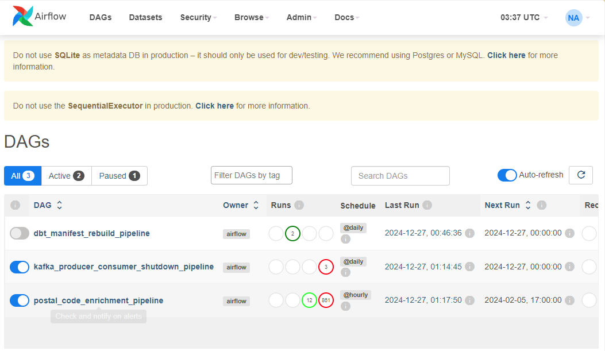
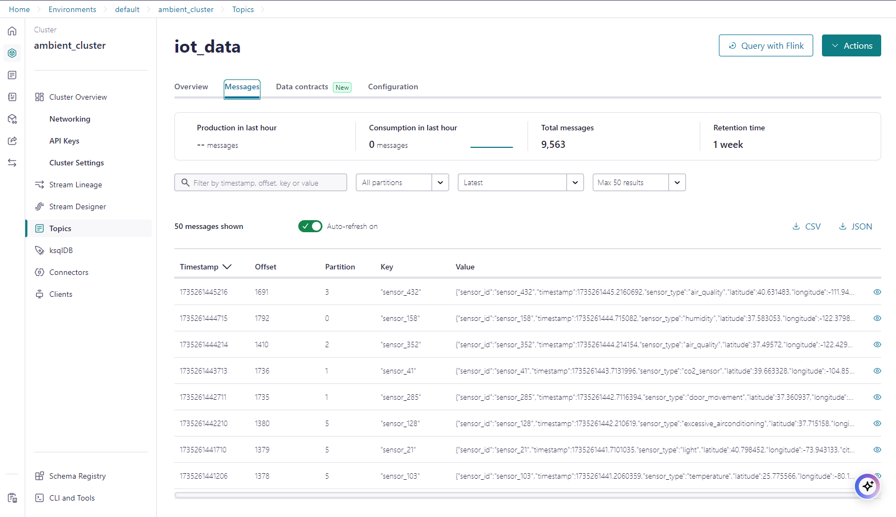
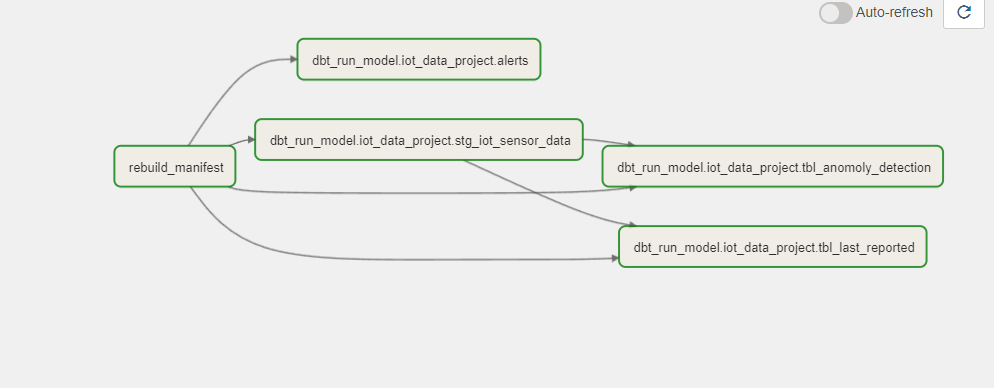
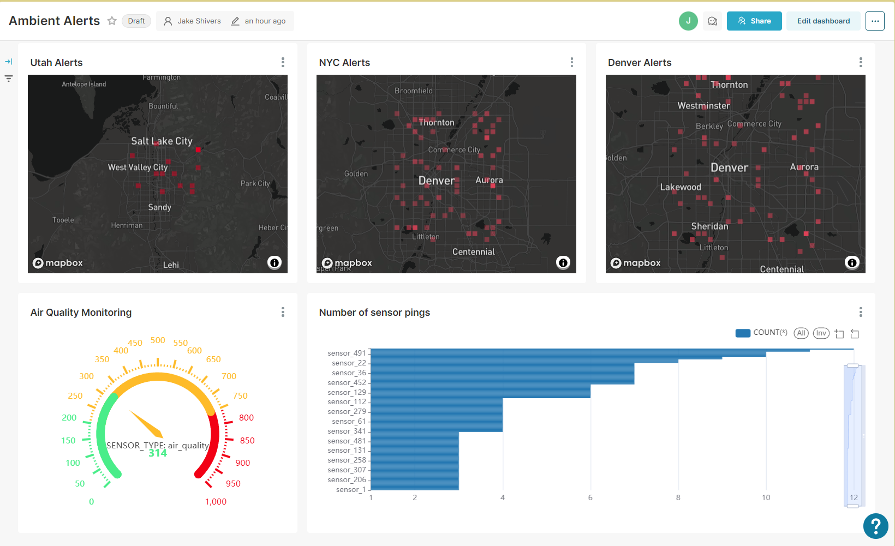
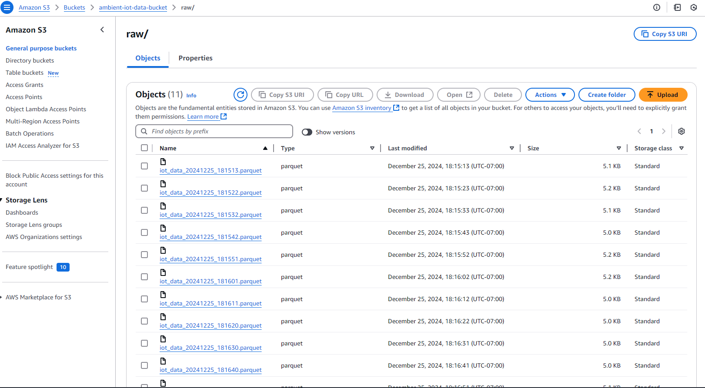

# **IoT Data Processing and Enrichment Pipeline**

This project is a comprehensive IoT data processing pipeline designed for real-time ingestion, transformation, and analysis of sensor data generated by a smart apartment complex. The pipeline is built using cutting-edge data engineering tools and best practices, enabling scalable, efficient, and insightful analytics.

## **Features**

- **Real-Time Data Ingestion**:
  - Uses Kafka for streaming IoT sensor data from a variety of devices, including motion detectors, temperature sensors, air quality monitors, doorbells, and more.
  - Simulates realistic scenarios, including edge cases like faulty or out-of-bound data.

- **Data Storage and Transformation**:
  - Stores raw data in AWS S3 as Parquet files for efficient storage and processing.
  - Leverages Snowflake for advanced transformations and analytics.
  - Implements a layered schema approach:
    - **Raw Schema**: Stores raw, unprocessed data.
    - **Staging Schema**: Prepares data for further transformations.
    - **Analytics Schema**: Provides enriched and aggregated views for business insights.

- **Data Enrichment**:
  - Enhances IoT data with geographic information (latitude, longitude, city, state).
  - Integrates external APIs for additional context, such as weather conditions and energy usage. Weather was added to Snowflake via Snowflake Marketplace.

- **Data Transformation with dbt**:
  - Builds modular, scalable models using dbt, including incremental models for efficient processing.
  - Supports both appends and upserts to handle changing data.

- **Orchestration with Apache Airflow**:
  - Automates the pipeline with Airflow DAGs for scheduled ingestion, enrichment, and reporting.
  - Provides logging, monitoring, and error handling to ensure robust operations.

- **Advanced Analytics**:
  - Configures Apache Superset (Preset) for dynamic dashboards and visualizations.
  - Supports key metrics like energy consumption, temperature trends, and sensor anomalies.
  - Enables stakeholders to drill into data with customizable filters and time ranges.

## **Technologies Used**

- **Data Ingestion**: Kafka, Python
- **Storage**: AWS S3, Parquet
- **Data Warehouse**: Snowflake
- **Data Transformation**: dbt
- **QA**: dbt Expectations
- **Orchestration**: Apache Airflow
- **Visualization**: Preset (Apache Superset)
- **APIs**: Integration with third-party APIs for enrichment (e.g., capturing postal code from lat/lon).

## **Use Cases**
- **Sensor Health Monitoring**:
  - Detect and address faulty sensors or irregular readings in real time.
- **Energy Optimization**:
  - Analyze energy consumption patterns for better efficiency.
- **Resident Insights**:
  - Provide actionable data to enhance tenant experiences, such as air quality trends or security events.
- **Predictive Maintenance**:
  - Forecast and prevent potential issues based on historical sensor data.

## **How It Works**

1. **Data Ingestion**:
   - IoT sensor data is streamed into Kafka topics.
   - Python producers simulate a smart apartment complex's IoT ecosystem.

2. **Data Processing**:
   - Raw data is ingested into AWS S3 and Snowflake.
   - dbt transformations clean, enrich, and model the data for analytics.

3. **Orchestration**:
   - Airflow schedules and monitors the pipeline, ensuring seamless end-to-end operations.

4. **Analytics and Visualization**:
   - Superset dashboards provide insights into energy usage, environmental metrics, and sensor performance.

---

### **Future Enhancements**
- Add machine learning models for anomaly detection and predictive analytics.
- Integrate additional APIs for deeper data enrichment.
- Scale the pipeline for larger IoT deployments.

---

### **Getting Started**

1. **Clone the Repository**:
   ```bash
   git clone https://github.com/your-repo/iot-data-pipeline.git
   ```

2. **Set Up the Environment**:
   - Install dependencies:
     ```bash
     pip install -r requirements.txt
     ```
   - Configure environment variables for AWS, Snowflake, and Kafka in `.env`.

3. **Run the Pipeline**:
   - Start Kafka producers:
     ```bash
     python kafka_producer.py
     ```
   - Launch Airflow:
     ```bash
     airflow scheduler
     airflow webserver
     ```

4. **Explore Dashboards**:
   - Access Superset (Preset) to visualize the data. 

## **Screenshots**
* ## Airflow 
* ## Kafka
* ## dbt
* ## Preset(dashboards)
* ## S3
